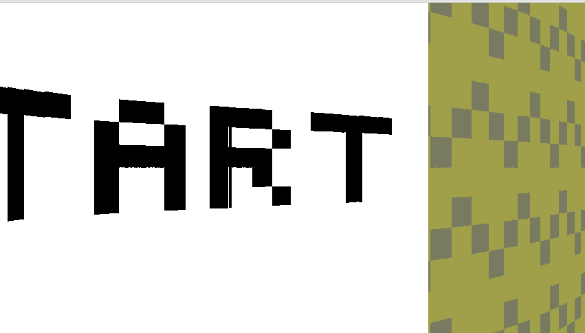

# maze
This is a largely unmodified version (a few tweaks for compatibility) of my final project for the Fall 2022 session of CIS 1200: Programming Languages and Techniques at the University of Pennsylvania. For this project, we were tasked with creating a game using Java Swing that used at least four "core concepts". The core concepts that I chose were 2D arrays, file I/O, recursion, and 3D graphics. Inspired by Wolfenstein 3D, I decided to make a simple maze game with raycasted "3D" (not truly 3D, but we'll get to that) graphics. You start in one corner of the maze and the goal is to reach the end of the maze in the opposite corner. This project took me about 3 (long) days to complete and I received an A for it. A breakdown of the different concepts follows.
## 2D Arrays
Raycasting engines are not truly 3D, they're really a 3D-looking projection of a 2D space. The maze map is represented as a 2D array, with each value either representing a wall or empty space in their corresponding grid space.
## File I/O
This game makes use of three custom binary file formats, ".save" for save games, and ".tile" for tile textures and ".manifest" for the "tile manifest". The ".save" save game format records the player's position, heading and time elapsed, as well as the entire maze map. Using the file menu in the game you can actually create and load saves, letting you return exactly to any previous game state. The ".tile" format stores wall tile textures (START, END and normal walls in the game). For efficiency it makes use of a color dictionary, where all colors used in the texture are pre-defined and given indices that can be referenced later in the texture array data. Fun fact: I actually manually entered every single pixel value for each of the 3 wall tiles in a hex editor, as I never made an editor or a converter. And the last and simplest format, the ".manifest" file is loaded each time the game starts, and provides file names for each of the ".tile" files that the game should be loading.
## Recursion
